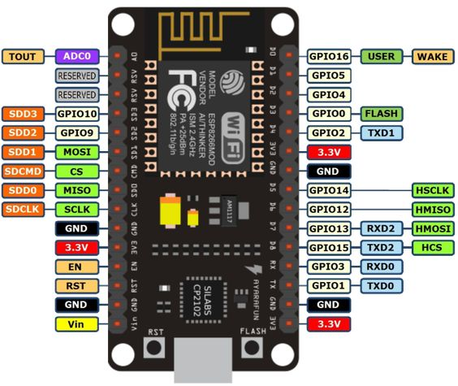

# esp8266-joomla
Examples of using the Joomla 4 API with ESP8266

---

We tested this exaples with NodeMCU 1.0

---
## Used libraries

* [ESP8266WiFi](https://arduino-esp8266.readthedocs.io/en/latest/esp8266wifi/readme.html)
* [WiFiClientSecure](https://arduino-esp8266.readthedocs.io/en/latest/esp8266wifi/client-secure-class.html)
* [rBase64](https://github.com/boseji/rBASE64)
* [ArduinoJson](https://arduinojson.org/)
